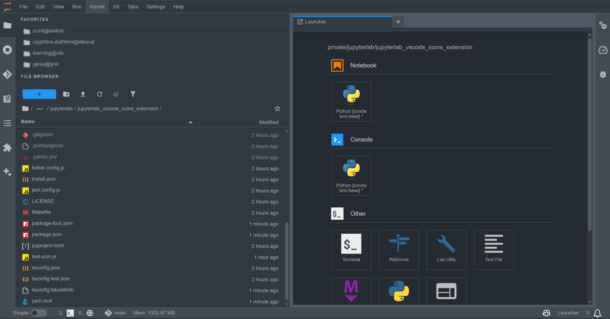

# JupyterLab VSCode Icons Extension

[](https://github.com/stellarshenson/jupyterlab_vscode_icons_extension/actions/workflows/build.yml)
[](https://www.npmjs.com/package/jupyterlab_vscode_icons_extension)
[](https://pypi.org/project/jupyterlab-vscode-icons-extension/)
[](https://pepy.tech/project/jupyterlab-vscode-icons-extension)
[](https://jupyterlab.readthedocs.io/en/stable/)
[](https://kolomolo.com)
[](https://www.paypal.com/donate/?hosted_button_id=B4KPBJDLLXTSA)

A shameless, unapologetic, and utterly brazen ripoff of the excellent VSCode file icons for JupyterLab. Because why should VS Code users have all the fun?

This extension brings 1414 beautiful file type icons from the vscode-icons project directly into your JupyterLab file browser. We saw those pretty icons, we wanted them, and now you can have them too - no permission asked, no apologies given (well, we did use the MIT license, so it's all legally kosher)

## Features



- 1414 file type icons covering virtually every language, framework, and config file you can think of
- Automatic icon detection based on file extensions and names
- Zero configuration required - just install and enjoy
- Lightweight integration using Iconify's JSON icon format
- Compatible with Jupytext - properly displays Python and Markdown icons for .py and .md notebook files
- No folders (we left those alone... for now)

## Requirements

- JupyterLab 4.0+
- A sense of humor about intellectual property (kidding - it's MIT licensed)
- Appreciation for pretty icons

## Installation

```bash
pip install jupyterlab_vscode_icons_extension
```

That's it. Restart JupyterLab and watch your bland, iconless file browser transform into a colorful, VSCode-inspired masterpiece

## Supported File Types

The extension recognizes hundreds of file types including:

- **Languages**: Python, JavaScript, TypeScript, Java, C/C++, Rust, Go, Ruby, PHP, R, Julia, and many more
- **Web**: HTML, CSS, SCSS, Vue, Svelte, React components
- **Data**: JSON, YAML, CSV, XML, TOML
- **Documentation**: Markdown, RST, PDF
- **Config**: Dockerfile, .gitignore, .env, Makefile, package.json
- **Notebooks**: Jupyter notebooks (.ipynb)

For the complete list of 1414 icons, see the [vscode-icons project](https://github.com/vscode-icons/vscode-icons)

## Configuration

Customize which icon groups to display via JupyterLab Settings:

1. Open JupyterLab Settings (Settings -> Settings Editor)
2. Search for "VSCode Icons"
3. Toggle icon groups on/off:
   - Programming Language Icons (Python, JS, TS, Java, C++, Rust, Go, etc.)
   - Web Development Icons (HTML, CSS, Vue, Svelte)
   - Data Format Icons (JSON, YAML, CSV, XML)
   - Configuration File Icons (Dockerfile, .gitignore, Makefile, package.json)
   - Documentation Icons (Markdown, RST, PDF)
   - Image File Icons (PNG, JPG, SVG)

Changes require a page refresh to take effect.

## Uninstallation

If you somehow tire of beautiful icons (we can't imagine why):

```bash
pip uninstall jupyterlab_vscode_icons_extension
```

## Credits

This extension shamelessly borrows icons from the excellent [vscode-icons](https://github.com/vscode-icons/vscode-icons) project by Roberto Huertas. Icons are delivered via [Iconify](https://iconify.design/), because we believe in standing on the shoulders of giants.

All icon assets remain under their original licenses (MIT for code, CC BY-SA for branded icons). We just wrapped them in a JupyterLab extension and called it a day.

**Custom Icons**: A few icons (Python, Markdown, README) were hand-crafted in Inkscape - because sometimes you need that perfect shade of purple and the exact right amount of snake eyes.

## Why This Exists

Because JupyterLab deserves pretty icons too. That's it. That's the whole justification
